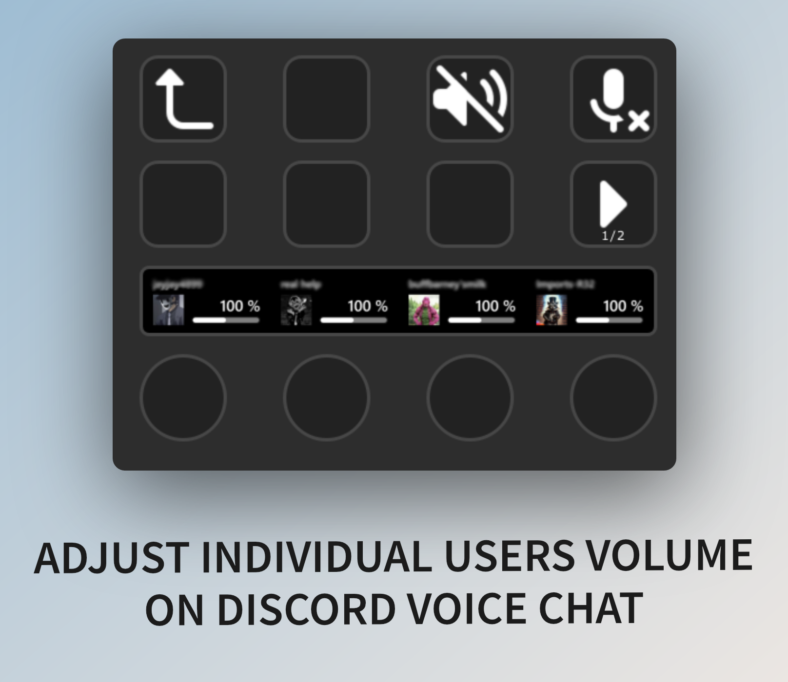

# Stream Deck Discord Volume Mixer
**Version 2 is not yet officially released on the marketplace (it's in the testing phase for now). You can however download it manually from the releases section in this repository.**

This is a plugin for Stream Deck for managing Discord Voice chats:
* Shows list of people in your voice chat.
* You can **adjust volume** for each user.
* You can **mute** each user by clicking on his name button.
* **Indication** when a user is **speaking**.
* **Self mute and deafen** buttons (deafen only on XL, mute on XL and STD)
* Supports **Standard, Mini, XL, Mobile and SD+ Decks**.
* You can adjust the audio mixer panel to your needs, it's quite modular - you can move buttons around etc.
* Tested on W10x64.
* If you really feel like giving me some money, you can use [PayPal](https://www.paypal.com/donate/?hosted_button_id=QZC5P67TBTRX6).

## Support

### Common problems:
* Stuck on `Loading property inspector...`
  * Try installing the [MSVC 2019 x64 runtime](https://learn.microsoft.com/en-us/cpp/windows/latest-supported-vc-redist?view=msvc-170).
  
* `ERR 0`: Missing client ID/secret
  * You haven't filled the credentials. See the Configuration section below.
  
* `ERR 1`: Could not connect to Discord
   * Check that the Discord app is running.
   * Check that the plugin is not blocked by firewall.
   * Check that you're not running Discord or the Stream Deck software under different privilleges (say as admin).
   * Try restarting the Discord.

* `ERR 2`: Your credentials are wrong
  * Check that you've configured everything properly on the Discord Developer Portal, it has to be exactly as in the screenshot in the Configuration section.
  * Make sure that you're connected on the Discord with the same account you've used on the Discord Developer Portal.
  * Try resetting your Client secret in the Discord Developer Portal and putting a new one into the plugin.
  * After everything, restart the Discord client.
  
* `ERR 4`: Double check that you're using the same account in the Discord App as in the Developer Portal.

* `ERR 8`:
  * Triple check the configuration in the Discord Developer Portal.
  * Turn off both Discord and Stream Deck software. Then turn on Discord. After it fully loads, turn on Stream Deck.
  
* Avatars are not visible, otherwise everything works.
  * Update the Stream Deck software.

### Troubleshooting
* **!!! First read Configuration below !!!**
* If the plugin does not work:
   * Try uninstalling and reinstalling it.
   * Make sure you're not running the Discord or the Stream Deck software with administrator privileges.
   * Check if there are not multiple profiles for "Discord Volume Mixer". If yes, remove them all and try again.
   * If that does not help, you can report the problem by following [these steps](DIAGNOSTICS.md).

* If you have some feedback, ask around on [Stream Deck Labs Discord server](https://discord.com/invite/294BQE6Xdp) on the `#danols-plugin-support` channel.

## Configuration
1. Download and install the plugin from the Stream Deck Marketplace (preferred, handles auto updates) or from [the releases](https://github.com/CZDanol/StreamDeck-DiscordVolumeMixer2/releases).
2. Add the "Discord Volume Mixer" button on your deck.
3. Go to the [Discord developer portal](https://discordapp.com/developers) (if the link asks you for login and then shows the Discord app, close the window and click this link again) and create an application.
   * **You must use the same account in to the Developer portal as in your Discord application, otherwise it won't work.** (You can add the other account as app tester though.)
   * You're setting this stuff up for your own account, not for any bot or anything else.
4. Create a new application. You can name it however you like, for example "Discord Volume Mixer".
5. In the newly created application details under Oauth2 settings (this page could be hidden under the menu button on the top left corner in smaller windows), set the redirect URI to `http://localhost:1337/callback`
6. Configure everything as in the screenshot below.
7. Hit "Save changes".
8. From the OAuth2 tab, copy `Client ID` and `Client secret` and paste it in your Discord Volume Mixer button settings (the button used to access the volume mixer).
   * If you don't see the client secret, but only the "Reset Secret" button, simply click on the button, it will give you a new secret.
9. Click on the Discord Volume Mixer button. Discord will ask you for some permissions & firewall and stuff.
10. Done.

**Don't play with the configuration of the buttons in the Volume Mixer profile unless you know what you're doing.**

## Third-party libraries, credits
* Qt 6 (tested on Qt 6.2.1 MSVC 2019 Win x64)
* [QtStreamDeck2](https://github.com/CZDanol/QtStreamDeck2) for Stream Deck control.
* [QtDiscordIPC](https://github.com/CZDanol/QtDiscordIPC/) for Discord control (IPC through QLocalSocket).
* [Icons8 icons](https://icons8.com/)

### Credits
* Big kudos to [Krabs](https://github.com/krabs-github) for helping me out with profiles for the XL version and testing and overall being awesome.

## TODO
* Self status button
